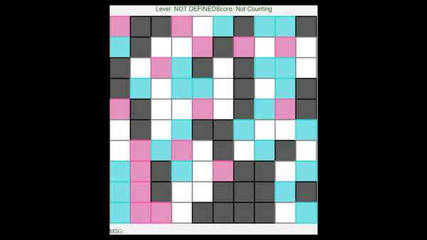

# BoxBreaker
A Simple Game JavaFX for beginner level

we have boxes with different levels you click a box to lose it's life with it's left top right down neighbours life.
white mean it's end of the box. ( dead )

(it was freelance work in 2020)
 
 * Tools used
 Java Programming language
 JavaFX User Interface framework

 preview
 
 

